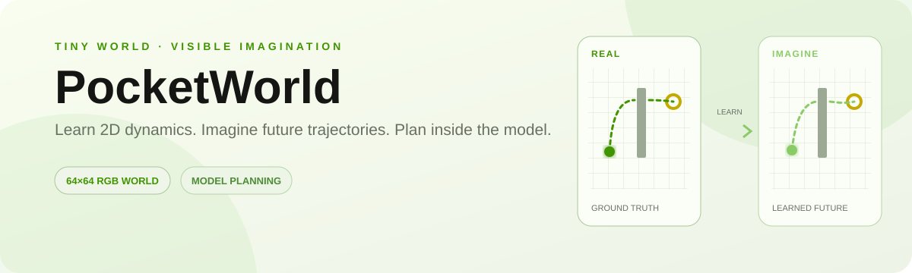
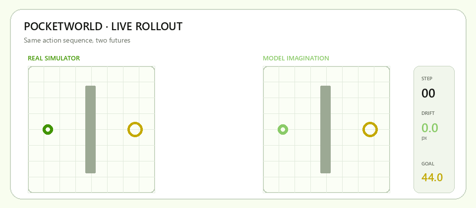
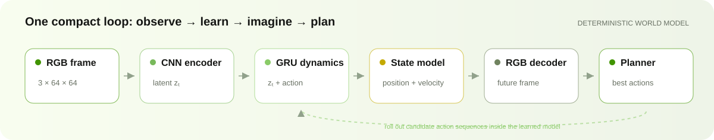
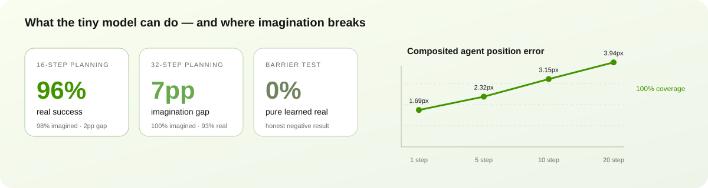

# PocketWorld

<p align="center">
  
</p>

<p align="center">
  <a href="https://github.com/ZhouYinLong-lab/Pocket-World-Model/actions/workflows/ci.yml"></a>
  <a href="https://www.python.org/"></a>
  <a href="https://pytorch.org/"></a>
  <a href="https://gymnasium.farama.org/"></a>
  <a href="LICENSE"></a>
  
  
</p>

## Why PocketWorld?

PocketWorld was inspired by the central idea behind [World Models](https://arxiv.org/abs/1803.10122): an agent can learn an internal model of its environment and use that model to reason about the future. It also follows the model-based reinforcement learning direction explored by [PlaNet](https://arxiv.org/abs/1811.04551) and [DreamerV3](https://arxiv.org/abs/2301.04104).

The project asks a deliberately concrete question:

> **How far can a tiny learned world model imagine before prediction error breaks planning?**

The motivation is that a one-step prediction can look convincing while a long imagined trajectory is already unsafe. PocketWorld therefore keeps both sides visible: the real simulator and the model's imagined future run side by side, and every plan is executed again in the real environment so the imagination gap can be measured rather than hidden behind a single reward number.

## What it does

PocketWorld is a small, reproducible world-model laboratory. A deterministic 64×64 RGB simulator contains an agent, inertia, walls, collisions, and a goal. From automatically collected interaction data, the model learns to predict the next observation and structured kinematics. A planner then rolls out many candidate action sequences inside the learned model, scores goal distance and collision risk, and executes the selected plan in the real simulator.

```text
real simulator → RGB/history + action → learned dynamics → imagined rollouts
       ↑                                                        ↓
       └──────────── execute, re-plan, and compare with reality ┘
```

## What problem it solves

This repository turns the vague claim “the model understands the environment” into testable failure modes:

- **Prediction versus control:** does a model that predicts the next frame also support useful multi-step planning?
- **Imagination bias:** when do imagined success and real success diverge?
- **Partial observability:** can recent RGB history recover velocity that is not visible in one frame?
- **Safety under model error:** can learned collision risk and a horizon-aware uncertainty boundary reduce fragile plans?
- **Reproducibility:** do the conclusions survive held-out maps, changed speeds, negative ablations, and three evaluation seeds?

The result is not a claim of general intelligence or state-of-the-art control. It is an observable testbed for understanding how world-model errors propagate from pixels to state estimates, collision decisions, action sequences, and real failures.

## What is implemented

- CNN encoder + GRU image dynamics + decoder, with supervised structured position and velocity prediction.
- State-conditioned RGB agent rendering so the learned trajectory remains visually inspectable even when a small decoded agent becomes blurry.
- Random-shooting and map-agnostic waypoint planning inside the learned model.
- Learned wall-relative collision-event prediction, learned temporal velocity initialization, closed-loop replanning, and a horizon-aware uncertainty risk boundary.
- Side-by-side real/imagination playback, ONNX export, browser inference, OOD evaluation, and machine-readable multi-seed reports.

## How it differs from related projects

| Project | Primary focus | PocketWorld's difference |
|---|---|---|
| [World Models](https://arxiv.org/abs/1803.10122) | Learn a compact world representation and train a controller in its hallucinated environment. | Keeps the same core intuition, but focuses on exposing prediction-to-planning failure in a tiny, inspectable setting. |
| [PlaNet](https://arxiv.org/abs/1811.04551) | Stochastic latent dynamics, reward prediction, and online latent planning from pixels. | Uses a simpler deterministic model and discrete actions, prioritizing transparent RGB/state/collision diagnostics over general control capacity. |
| [DreamerV3](https://arxiv.org/abs/2301.04104) | Train actor-critic agents from imagined trajectories across many tasks. | Does not aim to reproduce full RL training; it isolates the learned-model and planner interface in one controlled environment. |
| [TD-MPC2](https://arxiv.org/abs/2310.16828) | Large-scale decoder-free latent control for continuous domains. | Deliberately retains RGB decoding because seeing what the model imagines is part of the experiment, not just an implementation detail. |

In short, PocketWorld is best viewed as a **microscope for world-model reliability**: small enough to reproduce, visual enough to understand, and strict enough to compare imagined plans with real execution.

## Current direction: learned temporal velocity and calibrated uncertainty

The latest research direction replaces two hand-designed shortcuts with measurable learned components:

- **Learned temporal velocity:** a lightweight RGB motion encoder, latent-frame differences, and a GRU learn velocity from the latest four observations. An auxiliary position head makes the motion features explicitly locate the small agent. Planning and calibration blend this learned estimate with an observable RGB finite-difference estimate, while `--temporal-only` supports frozen-world-model fine-tuning.
- **Calibrated probabilistic uncertainty:** a transition head predicts diagonal state standard deviations for position and velocity. A held-out rollout split calibrates one scale per coordinate with residual quantiles, then the planner samples landing states from that calibrated distribution when estimating collision probability.
- **Cost-controlled planning:** ordinary candidates are ranked with the point model first; only a shortlist receives probabilistic Monte Carlo rescoring. This keeps the uncertainty experiment inspectable and computationally bounded.
- **Route-level alignment:** candidates can be scored by endpoint distance, average along-route distance, regressions in progress, and accumulated collision risk. The executor reports imagined-vs-real route alignment error after every action and uses short route prefixes before replanning.
- **Wall-aware global fallback:** when alignment breaks, the RGB wall mask is footprint-inflated and searched with two 8-connected A* routes (top/bottom). The executor tracks only route bends and endpoints with the learned kinematics, while an explicit geometry gate rejects wall-intersecting rollouts. This follows the global-planner/local-controller split used by mature navigation stacks such as [Nav2 Planner Server](https://docs.nav2.org/configuration/packages/configuring-planner-server.html) and its predictive [MPPI controller](https://docs.nav2.org/configuration/packages/configuring-mppic.html), while keeping PocketWorld small and observable.
- **Route commitment and budget:** once the hybrid fallback chooses a side, subsequent replans stay on that side unless its observed path becomes infeasible. A* remaining distance is compared with the remaining action budget and route regressions are penalized; the executor reports route progress, remaining distance, and emergency side switches.
- **Online shift detection:** after each observed transition, a standardized position/velocity innovation score can trigger a fresh replan. Its threshold is fit from an in-distribution rollout quantile and is explicitly evaluated separately from the OOD label.

This is a marginal, split-calibrated Gaussian approximation—not a Bayesian posterior or an ensemble. The evaluation report now includes learned velocity error, finite-difference baseline error, 50/80/90/95% empirical coverage, interval width, and state Gaussian NLL.

The current calibration matrix evaluates fresh rollouts at nominal speed, 0.8x speed, 1.2x speed, a changed map, and the joint changed-map/1.2x-speed condition. The v3 kinematics checkpoint uses a learned temporal velocity representation blended with observable RGB velocity and a conservative post-fit uncertainty shrink. Across three seeds, 90% coverage is **94.0%/94.3% position/velocity in-distribution**, **89.3%/93.7% on joint map+fast OOD**, and speed/map shift AUROC is **0.885–0.955**. The detector uses an eight-frame mature RGB/action window, so the result is a calibrated online gate rather than a per-frame oracle. See [the v3 maturity report](docs/results/evaluation-maturity-v3-final-3seed.json).

The formal imagination-gap evaluator fixes candidate sampling per seed and reports the same selected plan in the learned model and the real simulator. On the released v3-final checkpoint, 24-step imagined/real success is **100.0% / 95.3%** (4.7pp gap) and 32-step success is **100.0% / 93.3%** (6.7pp gap). This is the central reliability result: short-horizon planning transfers closely, while longer imagined rollouts expose a measurable but bounded bias. See [the imagination-gap result](docs/results/evaluation-imagination-gap-v3-final.json).

The implementation details and current three-seed diagnostic slice are tracked in the [temporal/probabilistic experiment plan](docs/plans/learnable-temporal-probability.md), [v3 maturity matrix](docs/results/evaluation-maturity-v3-final-3seed.json), and [formal imagination-gap result](docs/results/evaluation-imagination-gap-v3-final.json).

## New study: calibrated adaptive imagination horizon

The next study asks whether online calibrated uncertainty can shorten the
world-model imagination horizon before model error causes a real planning
failure. This is distinct from the historical v25 adaptive solver gate: v25
kept the horizon fixed and switched ordinary/robust MPC, while
`AdaptiveHorizonPolicy` selects among 8/16/24/32 imagined steps. Fixed ordinary
and fixed robust MPC remain separate baselines, and robust MPC plus adaptive
horizon is an explicit ablation.

The locked paired evaluator uses calibration seeds `53,67`, final holdout
seeds `11,23,41`, shared action banks, ID plus map/velocity OOD conditions,
and separate pure-learning versus explicit A* fallback reports. Every horizon
decision logs its uncertainty, collision risk, alignment, shift score, all
candidate risks, and hysteresis reason. See the [adaptive-horizon research
note](docs/research/adaptive-horizon-v1.md) and run the smoke protocol with:

```bash
python -m pocketworld.evaluate_adaptive_horizon --protocol configs/adaptive-horizon-v1.json --smoke
```

The locked formal run completed 60 paired episodes per condition across final
seeds `11,23,41`. In the pure-learning ID track, adaptive horizon reached
**11.7% real success / 15.53 collisions per episode**, versus fixed-16 at
**8.3% / 13.65**; map-shift, fast-speed, and joint OOD showed the same pattern
of lower query cost without lower collisions. The result therefore does **not**
support a safety-improvement claim: it is a negative/qualified computation-
budget adaptation result. The fixed-horizon position error curve still grows
from **2.34 px at 8 steps** to **11.19 px at 32 steps**. See the
[formal summary](docs/results/evaluation-adaptive-horizon-v1-summary.json).

Metric boundary: in this evaluator, `imagined_success` means that the first
selected plan's predicted endpoint reaches the goal; `real_success` is the
final result after closed-loop execution and replanning. Their difference is a
first-plan diagnostic, not a strict policy-level imagination gap. For a
same-plan imagined-versus-real claim, use the dedicated
[imagination-gap evaluator](docs/results/evaluation-imagination-gap-v3-final.json).

The v1 study is complete. The next supportable step is v2: explain why the
policy often collapses to horizon 8, replace candidate-set risk summaries with
the conditional risk of the finally selected trajectory, add observation
noise/delay and speed-estimation error, and then test the mechanism in
continuous-control and Unitree simulation. See the
[support application package](docs/application/README.md).

### Learned route-level planning comparison

The obstacle-navigation study now compares three distinct levels of abstraction:

| Method | Evaluation A* | Student signal | 240-task real success | Collisions / episode |
| --- | ---: | --- | ---: | ---: |
| Action-level RGB policy + DAgger | No | next discrete action | 59.2% | 17.63 |
| Route-mode RGB policy + waypoint controller | No | direct / top / bottom / gap | **100.0%** | **0.042** |
| Geometry-locked RGB/A* hybrid | Yes | visible global route | 99.2% | 0.242 |

The action-level student has reasonable held-out action accuracy (81.3%) but suffers from covariate shift: its real success drops to 0% on the shifted-barrier split. The route-level student predicts one persistent route mode from the initial RGB frame and goal, then uses an RGB-only local waypoint controller; it reaches 100% on all four barrier layouts across seeds `11,23,41` (20 tasks per layout and seed). This is a method comparison, not a claim that the learned policy has discovered general navigation: the route vocabulary and waypoint controller are deliberately specialized to this four-layout benchmark.

Machine-readable reports:

- [action-level student](docs/results/evaluation-learned-route-policy-v14.json)
- [route-level student](docs/results/evaluation-route-mode-policy-v15.json)
- [geometry-locked hybrid reference](docs/results/evaluation-route-aware-adaptive-v13-full.json)

Reproduce the route-level study with:

```bash
python -m pocketworld.evaluate_learned_route_policy --route-level \
  --train-seeds 101,103 --train-scenarios single_barrier,barrier_narrow_gap \
  --evaluation-seeds 11,23,41 --evaluation-episodes 20 --max-steps 64 \
  --epochs 300 --output artifacts/evaluation-route-mode-policy-v15.json
```

### Procedural multi-obstacle route study

The next comparison expands the fixed four-layout benchmark into deterministic
procedural maps with three or four vertical barriers and held-out endpoint
bands. It compares a continuous route-sketch student (v16) with a structured
per-barrier gap-center student (v17):

| Method | Learned output | Evaluation-time geometry | Real success | Collisions / episode |
| --- | --- | --- | ---: | ---: |
| Route sketch v16 | 5–9 continuous route points | RGB waypoint executor | 25.0% (9-point scale) | negative result |
| Gap route v17, raw | one gap center per barrier | none | **83.3%** | 1.417 |
| Gap route v17 + visible projection | one gap center per barrier | clamp to RGB-visible feasible gap | **100.0%** | **0.367** |

The v17 result uses 600 training tasks and 60 held-out tasks across three
evaluation seeds (`11,23,41`, 20 each). The student does **not** receive the
target gap center: its input is the initial RGB frame plus the goal, while the
gap center is only a teacher label. A* is used only as a data-quality filter to
discard disconnected procedural samples; labels, student inference, and
evaluation make no A* calls. The
projection is a separate RGB feasibility layer that clamps each prediction to
the visible gap interval; therefore the 100% number is a hybrid safety result,
not pure end-to-end learned obstacle navigation. The raw-vs-projected paired
ablation measures exactly how much that safety layer contributes.

The remaining limitation is scope: these procedural maps are left-to-right
vertical barriers with visible gaps. This is a controlled study of route
representation and model-error containment, not a claim of general 2D
navigation. See the [v17 machine-readable report](docs/results/evaluation-gap-route-policy-v17-honest-full.json).

Reproduce it with:

```bash
python -m pocketworld.evaluate_gap_route_policy \
  --train-seeds 101,103,107 --evaluation-seeds 11,23,41 \
  --train-episodes 200 --evaluation-episodes 20 --max-steps 140 \
  --epochs 360 --output artifacts/evaluation-gap-route-policy-v17.json
```

### v18 general obstacle representation study

v18 broadens the benchmark beyond vertical barriers to staggered blocks,
multi-channel walls, staircases, and offset L-shaped obstacles. Training uses
only `staggered_blocks` and `multi_channel`; the 60-task holdout uses all four
families across seeds `11,23,41`. The study compares route representations and
execution layers under one fixed protocol:

| Method | A* during evaluation | Real success | Collisions / episode |
| --- | ---: | ---: | ---: |
| Continuous route sketch | No | 6.7% | 15.35 |
| Route sketch + RGB projection | No | 1.7% | 8.15 |
| Coarse distance field | No | 50.0% | 6.20 |
| Distance field + RGB guard | No | 75.0% | 5.50 |
| Distance field + beam + RGB guard | No | **88.3%** | **2.20** |
| Learned route + A* fallback | Fallback only | 100.0% | 0.217 |
| RGB/A* reference | Yes | 100.0% | 0.067 |

The distance field is a learned 16×16 estimate of normalized route cost. A
fixed beam of four candidate grid paths is then followed using RGB edge checks;
the beam does not call A*. This improves generalization substantially over
fixed coordinate regression, but multi-channel maps remain the hard slice
(78.6% success, 5.93 collisions/episode). A conservative one-step action
shield was also tested and failed (63.3%, 40.62 collisions/episode), so it is
kept as a negative ablation rather than hidden from the comparison.

The reliable 100% methods still use observable RGB geometry plus repeated A*
planning. Thus v18 improves the learned route representation and quantifies
the remaining gap; it does not claim that pure learned obstacle navigation is
solved. See the [v18 machine-readable report](docs/results/evaluation-general-routes-v18-current-final.json).

### v23 coverage, density, and planner-method study

The latest study separates two questions that were previously confounded:
whether the model has seen enough obstacle families, and whether each family
has enough training density. Training is balanced by family and evaluated on
the same 60 held-out tasks for every condition:

| Training condition | Total samples | Samples / family / seed | Learned MPC success | Collisions / episode |
| --- | ---: | ---: | ---: | ---: |
| 2 families | 600 | 100 | 90.0% | 0.333 |
| 4 families | 600 | 50 | **95.0%** | **0.367** |
| 4 families | 1200 | 100 | 93.3% | 0.433 |

The result is deliberately non-monotonic: adding families at fixed total
budget helps this holdout, while doubling the four-family budget does not.
Coverage and per-family density therefore need to be reported as separate
variables rather than summarized as “more data is better.”

On the shared four-family/600 holdout, robust MPC matches ordinary MPC's
95.0% success and lowers collisions from 0.367 to 0.150, but costs 2.80 s of
planning per episode versus 255 ms. The guarded-MPC negative ablation reaches
only 66.7% success. The clearance-field variant is identical to the base
field on this task set, so its current loss is not yet demonstrated to change
the policy. RGB/A* reaches 100% with 0.067 collisions and remains a geometric
reference, not a pure learned result.

These are paired, fixed-protocol comparisons; no holdout result is used for
method selection. See the [coverage report](docs/results/evaluation-coverage-study-v23.json)
and [planner comparison](docs/results/evaluation-planner-comparison-v23.json).

The paired OOD matrix makes the robustness trade-off explicit:

| Condition | RGB projection | MPC | Robust MPC |
| --- | ---: | ---: | ---: |
| Nominal, speed 1.0 | 91.7% / 1.767 | **95.0% / 0.367** | **95.0% / 0.150** |
| Nominal, speed 1.25 | 76.7% / 15.083 | **95.0% / 0.533** | 93.3% / **0.433** |
| Walls +1, speed 1.0 | 73.7% / 2.456 | **78.9% / 0.474** | 77.2% / **0.298** |
| Walls +1, speed 1.25 | 64.9% / 12.070 | **78.9% / 0.877** | 73.7% / 1.053 |

Each cell is `real success / collisions per episode`. Robust MPC lowers risk
in three of four conditions, but loses success on the joint shift and costs
roughly 2.5–3.4 seconds of planning time per episode. This motivates the next
research step: a calibrated risk budget that can choose ordinary versus robust
MPC based on predicted uncertainty, instead of always enabling the expensive
envelope. See the [paired OOD report](docs/results/evaluation-coverage-study-v23-ood.json).

### v25 adaptive risk-gate study

The next experiment asked whether robust MPC should run on every step. An
adaptive gate computes an RGB/history-only risk score, enters robust MPC at a
calibrated threshold, and exits with hysteresis. Threshold selection uses
disjoint calibration seeds (`53,67`) and a fixed success-floor/collision/time
rule; the final holdout remains `11,23,41`.

| Method | Final success | Collisions / episode | Planning time | Robust calls / episode |
| --- | ---: | ---: | ---: | ---: |
| Ordinary MPC | **95.0%** | **0.367** | **178 ms** | 0 |
| Fixed robust MPC | 95.0% | **0.150** | 1.98 s | 77.7 |
| Calibrated adaptive MPC | 95.0% | 0.450 | 304 ms | 4.5 |

The calibrated gate reduces expensive robust calls by over 90% and is roughly
6.5× faster than fixed robust MPC, but it does not match ordinary MPC's
collision rate. Under the paired OOD matrix, adaptive MPC remains a mixed
result: it preserves 78.9% success on walls+1/speed1.25 with 1.035 collisions,
while ordinary MPC has 0.877 and fixed robust MPC has 1.053. The correct current
claim is therefore “compute-budget adaptation,” not calibrated safety.

This negative result is useful: the current risk score correlates with nominal
collisions but loses predictive value under joint map/speed shift. The next
research target is route-conditioned collision supervision or a calibrated
short-horizon collision probability head. See the [calibration report](docs/results/evaluation-adaptive-calibration-v25.json),
[v25 nominal comparison](docs/results/evaluation-planner-comparison-v25.json),
and [v25 OOD matrix](docs/results/evaluation-planner-comparison-v25-ood.json).

### v26 learned route-conditioned collision head

The heuristic adaptive gate could save compute but did not reliably predict
which ordinary MPC actions would collide. v26 replaces that score with a small
MLP trained on simulator-labelled short rollouts. Each input contains only the
current RGB wall crop, position, velocity history, goal/route waypoint, action,
and speed scale. Labels record whether a collision occurs within 1, 2, or 4
steps under randomized continuations. The head is trained on `101,103,107`,
calibrated on disjoint `53,67`, and evaluated on `11,23,41`.

| Condition | Real success | Collisions / episode | Planning time |
| --- | ---: | ---: | ---: |
| Nominal, speed 1.0 | **95.0%** | **0.317** | 544 ms |
| Nominal, speed 1.25 | **95.0%** | **0.400** | 449 ms |
| Walls +1, speed 1.0 | 73.7% | **0.404** | 782 ms |
| Walls +1, speed 1.25 | 77.2% | **0.754** | 658 ms |

The learned head reduces collisions relative to ordinary MPC in all four
conditions and improves the heuristic adaptive gate under the joint shift, but
it does not dominate every metric: walls+1/speed1.0 success is 73.7% versus
78.9% for ordinary MPC. This is a calibrated risk/success trade-off, not a
claim of solved obstacle navigation.

Reproduce it with:

```bash
python -m pocketworld.evaluate_collision_head \
  --route-checkpoint artifacts/coverage-study-v23-four_family_600-distance-field.pt \
  --train-seeds 101,103,107 --calibration-seeds 53,67 \
  --evaluation-seeds 11,23,41 --run-ood
```

See the [v26 nominal report](docs/results/evaluation-collision-head-v26-corrected.json)
and [v26 OOD report](docs/results/evaluation-collision-head-v26-ood.json).

### v27 probability calibration audit

v27 adds a post-hoc, per-horizon temperature fitted only on calibration maps
`53,67`. A separate map holdout (`29,31,37`) is used only for the calibration
audit, while the planner result remains on the untouched final tasks
`11,23,41`. On that independent calibration holdout, horizon-2 ECE changes
from **0.0248** to **0.0224** and Brier score from **0.06227** to **0.06227**
(rounded; exact values are in the JSON); AUROC remains **0.927**, as expected
for a monotonic temperature transform. The final planner remains **95.0%
success**, with **0.183 collisions/episode**; raw and calibrated gates are
identical at this resolution. This is a modest calibration improvement, not
evidence that probability calibration alone closes the OOD obstacle gap.

The full v27 report includes reliability bins, Brier/ECE/AUROC/AUPRC, threshold
recall/precision, and raw-vs-calibrated planner rows:
[`evaluation-collision-head-v27-final.json`](docs/results/evaluation-collision-head-v27-final.json).

Reproduce it with:

```bash
python -m pocketworld.evaluate_collision_head \
  --train-seeds 101,103,107 --calibration-seeds 53,67 \
  --calibration-holdout-seeds 29,31,37 --evaluation-seeds 11,23,41 \
  --output artifacts/evaluation-collision-head-v27-final.json
```

Reproduce the full comparison with:

```bash
python -m pocketworld.evaluate_general_routes \
  --train-seeds 101,103,107 --evaluation-seeds 11,23,41 \
  --train-episodes 200 --evaluation-episodes 20 --max-steps 160 \
  --points 13 --epochs 360 \
  --output artifacts/evaluation-general-routes-v18.json
```

### v19 RGB inertial MPC extension

v19 extends the best v18 learned route-field executor with a short-horizon
RGB-only model-predictive controller. It rolls out the known local inertia for
four steps, scores a fixed beam of action sequences, and checks each landing
against the same continuous footprint geometry used by `PocketWorldEnv`.
This is still a learned-planner experiment: the route distance field is
learned, the local controller sees only the current RGB wall mask and recent
frames, and evaluation does not call A*.

| Method | A* during evaluation | Real success | Collisions / episode | Final distance (px) |
| --- | ---: | ---: | ---: | ---: |
| v18 distance field + beam + RGB projection | No | 88.33% | 2.200 | 5.282 |
| v19 distance field + RGB inertial MPC | No | **91.67%** | **0.383** | **4.742** |
| v19 guarded MPC safety override | No | 75.00% | 4.900 | 11.406 |

The improvement is not attributed to “more search” alone. An earlier MPC
variant used a square-dilated wall mask and dynamic boundary margin and failed
because it rejected valid narrow passages. Reusing the simulator's continuous
collision geometry removed that mismatch. The guarded variant remains in the
report as a negative ablation: a trigger that occasionally replaces a good
baseline action is not automatically safer.

The full three-seed result is in the [v19 machine-readable report](docs/results/evaluation-general-routes-v19-mpc.json).
Run only the focused comparison with:

```bash
python -m pocketworld.evaluate_general_routes \
  --train-seeds 101,103,107 --evaluation-seeds 11,23,41 \
  --train-episodes 200 --evaluation-episodes 20 --max-steps 160 \
  --points 13 --epochs 360 --mpc-horizon 4 --mpc-beam-width 12 \
  --methods distance_field_beam_rgb_projection,distance_field_beam_mpc,distance_field_beam_guarded_mpc \
  --output artifacts/evaluation-general-routes-v19-mpc.json
```

### v20 execution-layer ablation

v20 keeps the v19 distance-field checkpoint and all 60 holdout tasks fixed,
then varies only the local executor. This separates route representation from
control design. The success interval is a normal-approximation 95% interval
over the 60 episodes; collision intervals use the episode-level sample
variance.

| Executor | Success | Collisions / episode | Planning time / episode |
| --- | ---: | ---: | ---: |
| v18 beam + RGB projection | 88.3% ± 8.1% | 2.200 ± 2.238 | 15.4 ms |
| RGB MPC, H=2, B=8 | 90.0% ± 7.6% | 0.517 ± 0.226 | 78.8 ms |
| RGB MPC, H=4, B=8 | 90.0% ± 7.6% | 0.333 ± 0.184 | 232.5 ms |
| RGB MPC, H=4, B=12 | 91.7% ± 7.0% | 0.383 ± 0.209 | 301.6 ms |
| RGB MPC, H=6, B=12 | **93.3% ± 6.3%** | 0.467 ± 0.158 | 532.6 ms |
| Action-fused velocity, H=4, B=12 | 90.0% ± 7.6% | **0.250 ± 0.145** | 309.9 ms |
| Robust velocity envelope, H=4, B=12 | 88.3% ± 8.1% | **0.117 ± 0.082** | 3,416.0 ms |

The result is a Pareto frontier rather than one universally best setting. The
planning-time column is a CPU observation from the reproducibility run, not a
hardware-independent throughput claim:
H=6 gives the highest success, action-fused velocity gives the lowest useful
collision rate at moderate cost, and the robust envelope is a safety-oriented
option with a large CPU penalty. The family breakdown shows that the gain is
not confined to one obstacle family: on `multi_channel`, the baseline has
5.714 collisions/episode versus 0.214 for H=4/B=8 RGB MPC; on `staircase`, it
has 2.105 versus 0.368 for action-fused H=4/B=12. Robustness is not free,
however: robust MPC reduces `multi_channel` success to 71.4%.

Reproduce the fixed-checkpoint study with:

```bash
python -m pocketworld.evaluate_mpc_ablation \
  --checkpoint artifacts/general-route-sketch-v19-mpc-distance-field.pt \
  --evaluation-seeds 11,23,41 --evaluation-episodes 20 \
  --output artifacts/evaluation-mpc-ablation-v20.json
```

See the [v20 machine-readable ablation](docs/results/evaluation-mpc-ablation-v20.json).

### v21 OOD speed/map shift and shift-aware fallback

v21 evaluates the fixed v19 route-field checkpoint on one paired holdout set
under three speed scales (`0.75`, `1.0`, `1.25`) and deterministic wall
translations. The wall shift is applied only after nominal holdout sampling;
each shifted task is reachability-checked and unreachable shifted tasks are
excluded from every method in that condition. The shift detector is calibrated
only from 60 train-split coarse wall signatures with a leave-one-out 99th
percentile threshold (`0.11328125`).

| Condition | RGB projection | RGB MPC | Shift detector + MPC/A* fallback |
| --- | ---: | ---: | ---: |
| nominal, speed 0.75 | 90.0% / 0.833 | 91.7% / 0.300 | 95.0% / 0.250 |
| nominal, speed 1.00 | 88.3% / 2.200 | 90.0% / 0.333 | 93.3% / 0.550 |
| nominal, speed 1.25 | 81.7% / 13.883 | **90.0% / 0.717** | 93.3% / 0.800 |
| walls −2 px, speed 1.25 | 80.0% / 21.833 | 91.7% / 2.700 | **98.3% / 2.567** |
| walls +1 px, speed 1.00 | 71.9% / 3.018 | 75.4% / 0.596 | **78.9% / 0.404** |

Cells report `real success / collisions per episode`. MPC is robust to speed
shift without retraining; the route field is the larger OOD bottleneck. The
fallback improves shifted-map performance, but it is a hybrid reference and
uses A* when the detector fires, so it is not a pure learned-planner result.
The detector fires on about 30–38% of cases, including nominal holdout tasks,
because the training split contains only two obstacle families while nominal
holdout includes four. Therefore this is a train-family/layout shift monitor,
not a perfect binary map-shift classifier.

The full paired report is in the [v21 OOD report](docs/results/evaluation-general-ood-v21.json): it records excluded unreachable tasks, family-level metrics, detector scores, fallback calls, and the no-A*-at-student-evaluation contract for the pure methods.

Reproduce it with:

```bash
python -m pocketworld.evaluate_general_ood \
  --checkpoint artifacts/general-route-sketch-v19-mpc-distance-field.pt \
  --train-seeds 101,103,107 --train-episodes 20 \
  --evaluation-seeds 11,23,41 --evaluation-episodes 20 \
  --map-shifts nominal,walls_x_minus2,walls_x_plus1 \
  --speed-scales 0.75,1.0,1.25 \
  --output artifacts/evaluation-general-ood-v21.json
```

### v28 route-progress budget and locked hybrid fallback

v28 addresses a route-level failure mode that local collision risk cannot see:
an action can be locally safe while the current route has become blocked, or
the remaining polyline cannot be completed within the remaining action budget.
The new `distance_field_budgeted_hybrid_mpc` method projects the observed RGB
agent position onto the learned route, tracks route progress and remaining
distance, and invokes a wall-aware A* fallback only after persistent blocking,
progress regression, or budget infeasibility. After a fallback, the new route
is locked for a short window to prevent immediately switching sides again.

On an independent three-seed holdout (`11,23,41`), 30 training episodes per
seed, 15 evaluation episodes total (5 per seed), the locked hybrid reaches **100.0%
real success** and **0.067 collisions/episode**, compared with **66.7%** and
**0.600** for learned-field MPC in the same medium-scale run. A* calls fall to
**1.33/episode** after cooldown and route locking, but mean planning time is
still about **5.01 s** versus **0.74 s** for baseline. This is therefore a
reliability improvement with an explicit latency cost, not a claim of a pure
learned planner.

The focused OOD smoke matrix keeps the checkpoint fixed and changes only wall
translation (`nominal`, `−2 px`, `+2 px`) and speed (`0.75`, `1.25`). The
budgeted hybrid reaches 100% success in all six conditions; the baseline ranges
from 33.3% to 77.8%. OOD fallback counts, route-lock steps, budget slack and
family-level rows are recorded in
[`evaluation-general-ood-v28-budgeted.json`](docs/results/evaluation-general-ood-v28-budgeted.json).

#### v28 fast-vs-robust ablation

The route gate and fallback can be separated from local robustness. The matched
three-seed holdout compares the same route field and the same fallback schedule:

| Method | Real success | Collisions/episode | A* calls/episode | Planning time |
| --- | ---: | ---: | ---: | ---: |
| Learned-field MPC | 80.0% | 1.100 | 0.00 | 1.17 s |
| Budgeted hybrid + robust MPC | 100.0% | 0.133 | 1.47 | 9.36 s |
| Budgeted hybrid + ordinary MPC | 100.0% | 0.400 | 1.47 | **0.61 s** |

The fast variant therefore preserves route completion while removing most of
the robust-MPC latency. In the six-condition OOD smoke matrix it remains at
100% success, with 0.22–0.67 collisions/episode and 0.13–0.19 s planning time.
The robust variant remains useful when collision minimization matters more than
latency; neither result is presented as a pure learned planner because both
use RGB-triggered A* fallback.

The scaled fixed-checkpoint replication uses 3 seeds × 20 episodes (60 paired
episodes per nominal condition; 57 after reachability exclusions for shifted
maps). On the nominal four-family holdout, learned-field MPC reaches **81.67%**
success with **0.883 collisions/episode**, while fast hybrid reaches **100.0%**
success with **0.500 collisions/episode**. Fast hybrid reaches 100.0% in all six
OOD speed/map conditions; baseline ranges from **63.16% to 93.33%**. The full
scaled report is [`evaluation-general-routes-v26-scaled.json`](docs/results/evaluation-general-routes-v26-scaled.json),
and the paired OOD report is [`evaluation-general-ood-v26-scaled.json`](docs/results/evaluation-general-ood-v26-scaled.json).

The fast ablation report is
[`evaluation-general-routes-v28-fast-ablation.json`](docs/results/evaluation-general-routes-v28-fast-ablation.json),
and its OOD report is
[`evaluation-general-ood-v28-fast.json`](docs/results/evaluation-general-ood-v28-fast.json).

#### RGB action-shield ablation

To test whether the remaining collisions can be reduced without robust MPC,
`distance_field_budgeted_hybrid_shielded_mpc` adds a pure RGB/history-only
action shield after ordinary MPC. It checks the proposed landing action and,
only when unsafe, chooses the closest safe one-step action among the four
discrete actions. It uses no simulator collision labels, learned collision
head, or additional A* call. The margin is calibrated on disjoint seeds
`(53,67)` with a success-first rule: margins 2/3/4/5/6 give 100/100/100/95.8/91.7%
success and 0.292/0.292/0.250/0.167/0.250 collisions per episode. Margin 4 is
therefore locked before the final comparison.

On the fixed three-seed × 20-episode holdout, the shield keeps **100.0%**
success and reduces collisions only from **0.500** to **0.467/episode**, while
planning time rises from **511.4 ms** to **520.9 ms**. In the six-condition
OOD matrix it improves three conditions, ties one, and worsens two; success
remains 100% throughout, with a roughly 14–20 ms latency increase. This is a
small, shift-sensitive safety improvement rather than a replacement for the
route-level hybrid. The full protocol summary is in
[`evaluation-general-routes-v28-shielded.json`](docs/results/evaluation-general-routes-v28-shielded.json)
and [`evaluation-general-ood-v28-shielded.json`](docs/results/evaluation-general-ood-v28-shielded.json).

#### Gated-robust threshold audit

The `distance_field_budgeted_hybrid_gated_mpc` variant first runs ordinary MPC
and escalates to robust MPC only when an RGB/history-only risk score exceeds a
threshold. The threshold is selected on disjoint calibration seeds (`53,67`)
from `{0.25, 0.35, 0.45, 0.55, 0.65}` with a 90% success floor. All five
thresholds produced the same calibration outcome, so the predeclared tie-break
selected `0.25`; this is evidence that the current observable score is not
well calibrated enough to tune collision risk.

On the final holdout, gated robust planning reaches the same **100% success**
as fast hybrid but has **0.433 collisions/episode**, **0.858 s** planning, and
0.97 robust calls/episode, versus fast hybrid's **0.400**, **0.679 s**, and
zero robust calls. In the six-condition OOD matrix, both remain at 100% success;
gated robust improves only nominal speed 0.75 and is otherwise tied or worse.
This negative ablation is retained: route-level progress/budget control is the
reliable contributor, while the current hand-crafted risk threshold does not
provide a stable collision reduction.

See the [gated calibration report](docs/results/evaluation-gated-hybrid-calibration-v25.json),
[final holdout comparison](docs/results/evaluation-general-routes-v28-gated-final.json),
and [OOD comparison](docs/results/evaluation-general-ood-v28-gated-final.json).

#### Route-completion gate on general obstacle maps

The next comparison asks whether a learned route-completion probability can
decide when to pay for the RGB/A* fallback. A nine-feature predictor uses only
the initial RGB wall layout, learned-field route length, direct-wall geometry,
start clearance, and speed scale. Labels come from real execution of the
field-MPC candidate on train maps; thresholds are selected on disjoint
calibration seeds `(53,67)` and the final checkpoint is fixed before the
holdout.

The standalone gate initially failed: its probabilities saturated near 1.0,
and a gate-only fallback reached only 83.3% holdout success and 63.2–93.3% OOD
success. This exposed an important failure mode—an initial route score cannot
replace closed-loop progress monitoring. The corrected method,
`distance_field_predicted_gate_hybrid`, keeps the initial probability gate but
also inherits the established route-progress, remaining-budget, cooldown, and
route-lock fallback.

| Method | Holdout success | Collisions/episode | A* calls/episode | Planning time |
| --- | ---: | ---: | ---: | ---: |
| Learned-field MPC | 81.67% | 0.883 | 0.000 | 849.8 ms |
| Fast budgeted hybrid | 100.0% | 0.500 | 1.467 | 510.2 ms |
| Predicted-gate + budgeted hybrid | 100.0% | **0.483** | 1.467 | 507.3 ms |

Across the six OOD speed/map conditions, predicted-gate hybrid remains at
100% success and matches fast hybrid collision rates exactly. The initial gate
fires in only 5% of nominal slow episodes and does not reduce A* calls or give
a stable OOD advantage. The research conclusion is therefore deliberately
modest: route-completion prediction is a useful diagnostic and a safe
extension point, but route-progress/budget feedback—not the initial probability
alone—is doing the reliable obstacle-crossing work.

Run the reproducible experiment with:

```bash
python -m pocketworld.evaluate_general_route_gate \
  artifacts/general-route-sketch-v28-budgeted-locked-distance-field.pt \
  --predictor-output artifacts/general-route-gate-v1.pt \
  --output artifacts/evaluation-general-route-gate-v1.json
```

See the [holdout result](docs/results/evaluation-general-route-gate-v1-final.json)
and [corrected OOD result](docs/results/evaluation-general-route-gate-ood-v1-final.json).

### v0.30 calibrated route-gate feature study

The next gate iteration fixes a feature-contract bug found by auditing the
actual route geometry: the old `field_route_distance_norm` was always zero
because the generated route ended at the goal. The predictor now uses twelve
visible features, including route turns, minimum wall clearance, blocked
fraction, and waypoint count. A scalar temperature is fitted on the disjoint
calibration split. Brier score improves from **0.0333 to 0.0266**, ECE from
**0.0320 to 0.0269**, and AUROC is **0.9773**.

On the fixed three-seed holdout, the calibrated gate preserves 100% success
but has **0.500 collisions/episode** versus 0.500 for fast hybrid, and makes
1.517 versus 1.467 A* calls. In the six-condition paired OOD matrix, collision
rate improves in three conditions, worsens in one, and ties in two; success is
100% everywhere and A* calls do not decrease. This is a calibrated risk
diagnostic, not yet a universally better planner.

```bash
python -m pocketworld.evaluate_general_route_gate \
  artifacts/general-route-sketch-v28-budgeted-locked-distance-field.pt \
  --predictor-output artifacts/general-route-gate-v2-calibrated.pt \
  --output artifacts/evaluation-general-route-gate-v2-calibrated.json
```

See the [calibrated holdout result](docs/results/evaluation-general-route-gate-v2-calibrated-final.json)
and [paired OOD result](docs/results/evaluation-general-route-gate-v2-calibrated-ood.json).

Reproduce the comparison with:

```bash
python -m pocketworld.evaluate_general_routes \
  --methods distance_field_beam_mpc,distance_field_budgeted_hybrid_mpc,distance_field_budgeted_hybrid_fast_mpc \
  --train-seeds 101,103,107 --evaluation-seeds 11,23,41 \
  --route-budget-margin 1.05 --route-progress-tolerance 1.5
```

Run the paired OOD protocol with:

```bash
python -m pocketworld.evaluate_general_ood \
  --methods distance_field_beam_mpc,distance_field_budgeted_hybrid_mpc \
  --map-shifts nominal,walls_x_minus2,walls_x_plus2 \
  --speed-scales 0.75,1.25 \
  --route-budget-margin 1.05 --route-progress-tolerance 1.5
```

<p align="center">
  
</p>

<p align="center"><sub>The same action sequence unfolds in the real simulator and the model's imagination while drift accumulates.</sub></p>

## The experiment

The central question is: **how far can a tiny model imagine before error breaks planning?**

The repository keeps the research loop inspectable:

- `pocketworld/env.py` — Gymnasium environment with inertia, collision, walls, and goal.
- `pocketworld/model.py` — CNN encoder + GRU image dynamics + CNN decoder, plus supervised structured kinematics, collision heads, and state-conditioned RGB agent composition.
- `pocketworld/data.py` — reproducible random-policy transition collection.
- `pocketworld/planner.py` — model rollout and random-shooting planning utilities.
- `pocketworld/train.py` — minimal one-step image-prediction training loop.
- `src/` — browser demo with side-by-side real/model rollouts and planning controls.

<p align="center">
  
</p>

## Results at a glance

<p align="center">
  
</p>

The released v3-final checkpoint reaches **97.3% imagined / 97.3% real success** at 16 planning steps. At 24–32 steps, imagined success stays at 100% while real success is **95.3% / 93.3%**, giving a formal **4.7pp / 6.7pp** gap. On named train/holdout obstacle maps, the hybrid route controller reaches **98.9% / 93.3%** two-waypoint task success and **98.9% / 95.0%** three-waypoint task success across three seeds, with **0.40 / 0.45** and **0.41 / 0.57** collisions per leg. The strict single-barrier fallback reaches **50.67% ± 2.49pp** real success, **6.88 ± 0.14px** final distance, and **1.14 ± 0.23** collisions per episode. This is a mature, reproducible world-model/planning laboratory; it is not yet a claim that pure learned obstacle navigation is solved.

### Maturity gate

PocketWorld is considered mature as a research prototype when it passes all of these gates: deterministic three-seed reports; 20-step position error below 5px on train and holdout maps; at least 90% real waypoint success on unseen layouts; fewer than one collision per leg; a 24-step imagination gap below 10pp; 90% uncertainty coverage approximately within 85–95%; OOD shift AUROC above 0.85; and a published checkpoint plus machine-readable results. v3-final passes these gates on the stated protocols. The remaining red flag is scope-specific: the pure learned barrier planner still needs the explicit RGB/A* fallback for reliable obstacle crossing.

The full methodology, per-seed statistics, OOD results, and negative ablations are recorded in [the evaluation report](docs/evaluation-2026-08.md).

## Download a trained model

The `v0.1.0` release publishes the final renderer checkpoint and browser-ready ONNX graph outside Git history:

- [`pocketworld-renderer-v5.pt`](https://github.com/ZhouYinLong-lab/Pocket-World-Model/releases/download/v0.1.0/pocketworld-renderer-v5.pt) — PyTorch training/evaluation checkpoint.
- [`pocketworld-renderer-v5.onnx`](https://github.com/ZhouYinLong-lab/Pocket-World-Model/releases/download/v0.1.0/pocketworld-renderer-v5.onnx) — one-step RGB and structured-position inference.

The `v0.2.0` learned-collision milestone adds the focused barrier checkpoint and its compatible ONNX graph:

- [`pocketworld-collision-v5.pt`](https://github.com/ZhouYinLong-lab/Pocket-World-Model/releases/download/v0.2.0/pocketworld-collision-v5.pt) — collision curriculum, learned risk head, and calibrated kinematics.
- [`pocketworld-collision-v5.onnx`](https://github.com/ZhouYinLong-lab/Pocket-World-Model/releases/download/v0.2.0/pocketworld-collision-v5.onnx) — browser-compatible RGB and position outputs from the same checkpoint.

The `v0.3.0` route-aware probabilistic milestone publishes the v8 checkpoint and its complete three-seed result:

- [`pocketworld-temporal-probability-v8.pt`](https://github.com/ZhouYinLong-lab/Pocket-World-Model/releases/download/v0.3.0/pocketworld-temporal-probability-v8.pt) — temporal velocity, calibrated uncertainty, and route-aware planning checkpoint.
- [`evaluation-route-aware-temporal-probability-v8-full.json`](https://github.com/ZhouYinLong-lab/Pocket-World-Model/releases/download/v0.3.0/evaluation-route-aware-temporal-probability-v8-full.json) — exact protocol and per-seed metrics.

The `v0.4.0` maturity milestone publishes the calibrated v3-final checkpoint and formal imagination-gap evidence:

- [`pocketworld-map-suite-v3-final.pt`](https://github.com/ZhouYinLong-lab/Pocket-World-Model/releases/download/v0.4.0/pocketworld-map-suite-v3-final.pt) — learned kinematics, temporal velocity, calibrated uncertainty, and map-suite training metadata.
- [`pocketworld-map-suite-v3-final.onnx`](https://github.com/ZhouYinLong-lab/Pocket-World-Model/releases/download/v0.4.0/pocketworld-map-suite-v3-final.onnx) — browser-compatible one-step RGB/position graph.
- [`evaluation-imagination-gap-v3-final.json`](https://github.com/ZhouYinLong-lab/Pocket-World-Model/releases/download/v0.4.0/evaluation-imagination-gap-v3-final.json) — deterministic 16/24/32-step imagined-versus-real sweep.

The `v0.5.0` planner-comparison milestone publishes the fixed-budget tournament evidence:

- [`evaluation-planner-tournament-open-v3-final.json`](https://github.com/ZhouYinLong-lab/Pocket-World-Model/releases/download/v0.5.0/evaluation-planner-tournament-open-v3-final.json) — paired open-space comparison.
- [`evaluation-planner-tournament-barrier-v3-final.json`](https://github.com/ZhouYinLong-lab/Pocket-World-Model/releases/download/v0.5.0/evaluation-planner-tournament-barrier-v3-final.json) — paired single-barrier comparison.

The `v0.6.0` expansion publishes the six-method tournament with Beam Search and collision-aware CEM:

- [`evaluation-planner-tournament-open-v4.json`](https://github.com/ZhouYinLong-lab/Pocket-World-Model/releases/download/v0.6.0/evaluation-planner-tournament-open-v4.json)
- [`evaluation-planner-tournament-barrier-v4.json`](https://github.com/ZhouYinLong-lab/Pocket-World-Model/releases/download/v0.6.0/evaluation-planner-tournament-barrier-v4.json)
- [`evaluation-planner-tournament-barrier-v5-risk-budget.json`](https://github.com/ZhouYinLong-lab/Pocket-World-Model/releases/download/v0.6.0/evaluation-planner-tournament-barrier-v5-risk-budget.json) — calibrated 0.15 collision-risk budget ablation.

Only load checkpoints from the official release; PyTorch checkpoint files must be treated as trusted executable artifacts.

## Run the research core

```bash
python -m venv .venv
.\.venv\Scripts\Activate.ps1
pip install -e ".[dev,export]"
pytest
python -m pocketworld.train --epochs 5 --episodes 100 --unroll-horizon 8
python -m pocketworld.evaluate artifacts/pocketworld.pt --episodes 20 --seeds 11,23,41
```

The checkpoint is written to `artifacts/pocketworld.pt`.
The evaluation command writes `artifacts/evaluation.json` with image error, decoded-position error, latent-position error, OOD generalization, and imagined/real planning success across 8/16/24/32-step planning horizons.

To train and evaluate the learned temporal/probabilistic direction:

```bash
python -m pocketworld.train --epochs 8 --episodes 500 --validation-episodes 100 --batch-size 32 --unroll-horizon 8 --sticky-probability 0.75 --full-state-range --output artifacts/pocketworld-temporal-probability.pt
python -m pocketworld.train --resume artifacts/pocketworld-temporal-probability.pt --temporal-only --epochs 20 --episodes 500 --validation-episodes 100 --batch-size 32 --unroll-horizon 8 --sticky-probability 0.75 --full-state-range --output artifacts/pocketworld-temporal-probability-tuned.pt
python -m pocketworld.evaluate artifacts/pocketworld-temporal-probability-tuned.pt --episodes 50 --candidates 1024 --seeds 11,23,41 --output artifacts/evaluation-temporal-probability.json
```

The collision evaluator adds `learned_velocity_probabilistic_closed` alongside the existing point, history, and robust-radius baselines. Its probabilistic sampler is applied only to the planner shortlist so a larger candidate count remains practical.

To reproduce the completed v8 probabilistic barrier revalidation:

```bash
python -m pocketworld.evaluate_collision artifacts/pocketworld-temporal-probability-v8.pt --episodes 50 --horizon 48 --candidates 1024 --seeds 71,83,97 --only learned_velocity_probabilistic_closed --output artifacts/evaluation-temporal-probability-probabilistic-v8-full.json
```

The committed [v8 probabilistic result](docs/results/evaluation-temporal-probability-probabilistic-v8-full.json) contains per-seed metrics and mean/std summaries. The committed [OOD calibration matrix](docs/results/evaluation-temporal-probability-ood-v8.json) records the speed/map stability boundary.

## Map and task generalization

The original staggered-wall map remains the compatibility baseline, but the environment now exposes named layouts: `default`, `single_barrier`, `double_barrier`, `cross`, `zigzag`, and `open`. The `train` suite contains the first three; `cross` and `zigzag` are held out as unseen obstacle layouts. Rollout collection can train on the named suite instead of silently perturbing one map:

```bash
python -m pocketworld.train --resume artifacts/pocketworld-temporal-probability-v8.pt --epochs 12 --episodes 1000 --validation-episodes 200 --batch-size 32 --unroll-horizon 16 --sticky-probability 0.75 --full-state-range --map-suite train --output artifacts/pocketworld-map-suite-v1.pt
```

The generalization evaluator measures per-map multi-step prediction error and sequential two-waypoint tasks:

```bash
python -m pocketworld.evaluate_generalization artifacts/pocketworld-map-suite-v3-final.pt --episodes 20 --horizon 64 --candidates 32 --seeds 11,23,41 --train-suite train --holdout-suite holdout --waypoints 2 --output artifacts/evaluation-map-suite-v3-final-3seed.json
```

The original v1 diagnostic is preserved in [evaluation-map-suite-v1-full.json](docs/results/evaluation-map-suite-v1-full.json). The v3-final kinematics checkpoint preserves the four-action RGB-observed route follower, continuous-coordinate landing safety guard, and physically traversable zig-zag holdout while reducing 20-step position error to **3.02 ± 0.27px on train / 3.72 ± 0.32px on unseen maps**. The formal [three-seed two-waypoint result](docs/results/evaluation-map-suite-v3-kinematics-3seed.json) uses 20 episodes per map, 64-step execution budgets, and 32 candidates: task success is **98.9% ± 1.6pp / 93.3% ± 2.4pp**, waypoint completion is **98.9% / 94.2%**, and mean collisions are **0.40 / 0.45 per leg**. These are explicitly hybrid benchmarks: learned dynamics and collision-aware prediction plus RGB-only visible-route control.

The three-waypoint stress test uses the same three seeds and a 96-step budget. It reaches **98.9% train / 95.0% unseen task success**, **98.9% / 97.2% waypoint completion**, and **0.41 / 0.57 collisions per leg**; see [evaluation-map-suite-v3-kinematics-waypoint3-3seed.json](docs/results/evaluation-map-suite-v3-kinematics-waypoint3-3seed.json).

For the maturity-gate calibration and OOD protocol:

```bash
python -m pocketworld.evaluate_maturity artifacts/pocketworld-map-suite-v3-final.pt --episodes 50 --horizon 8 --seeds 11,23,41 --output artifacts/evaluation-maturity-v3-final-3seed.json
```

The [three-seed maturity report](docs/results/evaluation-maturity-v3-final-3seed.json) gives 90% position/velocity coverage of **94.0%/94.3% in-distribution**, **89.3%/93.7% on joint map+fast OOD**, and speed/map AUROC of **0.885–0.955**. The shift score waits for an eight-frame mature RGB/action window, keeping the detector observable and reproducible. The matrix is inside the practical 85–95% coverage band up to ordinary seed variation; it is not a guarantee of calibration under arbitrary physics changes.

To reproduce the formal imagination-gap sweep:

```bash
python -m pocketworld.evaluate_imagination artifacts/pocketworld-map-suite-v3-final.pt --episodes 50 --horizons 16,24,32 --candidates 256 --seeds 11,23,41 --output artifacts/evaluation-imagination-gap-v3-final.json
```

The [formal result](docs/results/evaluation-imagination-gap-v3-final.json) reports a **4.7pp** gap at 24 steps and **6.7pp** at 32 steps. The evaluator fixes candidate sampling per seed, so the imagined and real rates refer to the same selected action sequences.

## Planner method comparison

The project now includes a fixed-budget-per-call planner tournament. It compares Random Shooting, categorical CEM, Beam Search, learned collision planning, collision-aware CEM, and the closed-loop route-aware hybrid on paired tasks using the same v3-final checkpoint and 256 candidate budget per planning call. In open space, CEM and Beam Search reach **100% imagined / 100% real success**, versus **96.7% / 96.7%** for Random Shooting. On the single-barrier benchmark, CEM and Beam Search remain **100% imagined / 0% real**, collision-aware CEM with a calibrated 0.15 risk budget reaches **0% imagined / 0% real**, learned collision reaches **60.0% real**, and route-aware hybrid reaches **100% real with 0.65 collisions per episode**. Closed-loop query totals are reported separately because route-aware planning replans repeatedly. The result separates search quality from model adequacy: better search cannot repair an obstacle model that predicts the wrong world. See the [planner tournament protocol and analysis](docs/plans/planner-tournament.md), [open-space result](docs/results/evaluation-planner-tournament-open-v4.json), and [risk-budget barrier ablation](docs/results/evaluation-planner-tournament-barrier-v5-risk-budget.json).

Reproduce the comparison with:

```bash
python -m pocketworld.evaluate_planners artifacts/pocketworld-map-suite-v3-final.pt --episodes 20 --horizon 16 --candidates 256 --seeds 11,23,41 --scenario open --output artifacts/evaluation-planner-tournament-open-v3-final.json
python -m pocketworld.evaluate_planners artifacts/pocketworld-map-suite-v3-final.pt --episodes 20 --horizon 48 --candidates 256 --seeds 11,23,41 --scenario single_barrier --output artifacts/evaluation-planner-tournament-barrier-v3-final.json
```

For a larger run, use 1,000 training trajectories and three evaluation seeds:

```bash
python -m pocketworld.train --epochs 12 --episodes 1000 --validation-episodes 200 --batch-size 32 --unroll-horizon 16 --output artifacts/pocketworld-large.pt
python -m pocketworld.evaluate artifacts/pocketworld-large.pt --episodes 50 --candidates 1024 --seeds 11,23,41 --output artifacts/evaluation-large.json
```

For the expanded state-coverage run used by the planning diagnostics:

```bash
python -m pocketworld.train --epochs 10 --episodes 1000 --validation-episodes 200 --batch-size 32 --unroll-horizon 16 --sticky-probability 0.75 --full-state-range --output artifacts/pocketworld-structured-wide.pt
python -m pocketworld.evaluate artifacts/pocketworld-structured-wide.pt --episodes 50 --candidates 1024 --seeds 11,23,41 --output artifacts/evaluation-structured-wide.json
```

To train the collision-event ablation with single-barrier maps mixed into the data:

```bash
python -m pocketworld.train --epochs 10 --episodes 1000 --validation-episodes 200 --batch-size 32 --unroll-horizon 16 --sticky-probability 0.75 --full-state-range --barrier-probability 0.25 --output artifacts/pocketworld-collision-barrier.pt
```

For the focused learned-collision result, fine-tune the wall-relative risk head and then identify the three compact kinematic parameters from free transitions:

```bash
python -m pocketworld.train --resume artifacts/pocketworld-renderer-v5.pt --collision-only --epochs 10 --episodes 1500 --validation-episodes 300 --batch-size 64 --unroll-horizon 16 --sticky-probability 0.75 --full-state-range --barrier-probability 1 --collision-seek-probability 0.8 --output artifacts/pocketworld-collision-v4.pt
python -m pocketworld.train --resume artifacts/pocketworld-collision-v4.pt --kinematics-only --epochs 40 --episodes 500 --validation-episodes 100 --batch-size 64 --unroll-horizon 16 --sticky-probability 0.8 --full-state-range --output artifacts/pocketworld-collision-v5.pt
```

The report contains both per-seed runs and recursive mean/std summaries so planning gaps are not based on one lucky rollout.

The latest large-scale result is 98% imagined / 96% real success at 16 planning steps, with the real-vs-imagined gap reaching 7 percentage points at 24–32 steps.

The planner also includes an explicit `collision_aware=True` baseline, structured top/bottom detour proposals, and route-preserving replanning for barrier experiments. They are kept separate from the learned model so obstacle results remain honest: detour proposals improve the barrier distance, but reliable collision-state modeling is still needed for closed-loop success.

Collision-event and wall-relative-head variants are tracked as ablations in the evaluation report; the main checkpoint remains the structured-kinematics model without barrier-mix training.

Learned imagined collisions now freeze the compact state and zero velocity after an event. Peak collision risk is kept separate from geometric goal distance, so imagined success is no longer distorted by the planner's risk penalty.

The learned planner proposes map-agnostic two-bend waypoint routes and lets the wall-relative collision head rank them. It does not inspect wall boxes when running in pure learned mode; the explicit pixel planner remains a separately reported baseline.

### Risk-estimator comparison

To test whether the remaining barrier gap is caused by an underpowered risk estimator, the project now compares the single learned collision head with a three-checkpoint ensemble and a split-conformal upper-risk wrapper. The comparison keeps the v3-final dynamics model, 48-step horizon, 256-candidate budget, and paired three-seed barrier tasks fixed. The ensemble reaches **20.0% real success** and the conformal wrapper reaches **0.0%**, versus **61.7%** for the single learned collision planner. Conformal coverage is **100%**, but its calibration quantile is **0.9984** because every selected calibration route collided; it therefore stops almost immediately. This is an intentional negative result: stronger uncertainty guarantees can become unusable when the calibration unit is mismatched to route-level failure. See the [uncertainty-method comparison](docs/plans/uncertainty-methods.md) and [machine-readable report](docs/results/evaluation-uncertainty-barrier-v1.json).

The reliability bins sharpen the diagnosis: ensemble plans with predicted risk in the 0–0.20 range still collide on **100%** of held-out routes. The next optimization target is therefore route-conditioned collision supervision and route-completion prediction, not a larger search population.

### Route-conditioned completion study

The next experiment adds an explicit `RouteCompletionPredictor` trained on real simulator outcomes for complete candidate routes. It achieves **0.997 held-out AUROC**, but planner transfer is much harder: weight 10 reaches **63.3% real success** versus **61.7%** for learned collision, weight 64 collapses to **28.3%**, the risk-gated/hard-negative variants reach **51.7% / 53.3%**, and online route-completion MPC falls to **5.0%** despite replanning. The paired comparison is therefore a controlled negative result: candidate-level route classification is strong, but its score does not yet survive model-missed collisions during planning. See the [route-completion study](docs/plans/route-completion.md) and its [MPC report](docs/results/evaluation-route-completion-barrier-v6-mpc.json).

Reproduce the latest route-conditioned experiment with:

```bash
python -m pocketworld.evaluate_route_completion artifacts/pocketworld-map-suite-v3-final.pt \
  --train-seeds 101,103 --evaluation-seeds 11,23,41 --train-episodes 12 --evaluation-episodes 20 \
  --calibration-candidates 32 --candidates 256 --horizon 48 --hard-negative-rounds 1 \
  --predictor-output artifacts/route-completion-v2-hard-negative.pt \
  --output artifacts/evaluation-route-completion-barrier-v5-hard-negative.json
```

The follow-up adds an isolated `route_completion_safe_gate` ablation: before
the route score is trusted, the planner rejects imagined trajectories that
intersect the footprint-inflated wall mask extracted from the current RGB
observation. On the same 60 paired barrier tasks, this raises real success to
**65.0%** and lowers collisions to **2.20/episode**, versus **61.7%** and
**2.47/episode** for learned collision. The paired gain is only **+3.33pp**
(`0, 0, +10pp` across the three seeds), so the result is a bounded safety
improvement, not a claim that the learned model now solves obstacle
traversal. The high-query route-aware hybrid remains at **100.0%** real
success. See the [RGB safety-gate ablation](docs/plans/route-completion.md)
and [machine-readable v7 result](docs/results/evaluation-route-completion-barrier-v7-safe-gate.json).

The next ablation compares three ways to use the same RGB wall evidence. A
joint gate requires both learned-risk and RGB feasibility; an RGB-only gate
uses only the visible wall mask; a soft method adds a wall-intersection cost
without hard rejecting every risky route. On the same 60 paired barrier tasks:

| Method | Real success | Collisions/episode | Imagined RGB wall intersection | Paired delta |
| --- | ---: | ---: | ---: | ---: |
| Learned collision | 61.7% | 2.47 | 41.7% | — |
| Joint RGB gate | 65.0% | 2.20 | 11.7% | +3.33pp |
| RGB-only gate | 65.0% | 2.02 | 6.7% | +3.33pp |
| Soft RGB penalty | **71.7%** | **2.02** | 21.7% | **+10.00pp** |

The soft penalty is currently the strongest one-shot method, but its result is
still protocol-specific: three seeds, one barrier layout, and the same tasks
used for method comparison. The fixed-predictor runner makes this comparison
reproducible without retraining the route predictor:

```bash
python -m pocketworld.evaluate_safety_methods \
  artifacts/pocketworld-map-suite-v3-final.pt \
  --route-predictor artifacts/route-completion-v4-safety-methods.pt \
  --evaluation-seeds 11,23,41 --evaluation-episodes 20 \
  --candidates 256 --horizon 48 \
  --output artifacts/evaluation-safety-methods-barrier-v9.json
```

See the [safety-mechanism protocol](docs/plans/route-completion.md) and
[machine-readable v9 result](docs/results/evaluation-safety-methods-barrier-v9.json).

### Penalty selection and OOD generalization

The soft penalty was not chosen from the OOD results. A six-value scan on the
original single-barrier task (`0, 8, 16, 32, 64, 128`) selected **16** by a
predeclared rule: highest mean success, then smallest weight on ties. It gives
**71.7%** in-distribution success and **+10.0pp** paired improvement.

When frozen and moved to held-out shifted barriers, narrow/wide gaps, and
speed scales 0.8/1.2, the result reverses: soft planning is never better than
the learned-collision baseline, with paired deltas from **0.0pp to −25.0pp**.
The gap tasks were corrected to place start and goal outside the wall footprint
on opposite sides, so they require an actual detour. The current evidence is
therefore precise: soft RGB penalties improve this barrier distribution but do
not yet generalize across map geometry and dynamics shifts.

Reproduce the selection and held-out protocols with the resumable sweep runner:

```bash
python -m pocketworld.evaluate_safety_sweep \
  artifacts/pocketworld-map-suite-v3-final.pt \
  --route-predictor artifacts/route-completion-v4-safety-methods.pt \
  --penalties 0,8,16,32,64,128 --scenarios single_barrier \
  --speed-scales 1.0 --evaluation-seeds 11,23,41 --evaluation-episodes 20 \
  --candidates 256 --horizon 48 --resume-from artifacts/safety-sweep-selection-v11-progress.json \
  --output artifacts/evaluation-safety-sweep-selection-v11.json

python -m pocketworld.evaluate_safety_sweep \
  artifacts/pocketworld-map-suite-v3-final.pt \
  --route-predictor artifacts/route-completion-v4-safety-methods.pt \
  --penalties 16 --scenarios barrier_shifted,barrier_narrow_gap,barrier_wide_gap \
  --speed-scales 0.8,1.2 --evaluation-seeds 11,23,41 --evaluation-episodes 20 \
  --candidates 256 --horizon 48 --resume-from artifacts/safety-sweep-ood-v12-progress.json \
  --output artifacts/evaluation-safety-sweep-ood-v12.json
```

See the [selection report](docs/results/evaluation-safety-sweep-selection-v11.json)
and [OOD holdout report](docs/results/evaluation-safety-sweep-ood-v12.json).

### Executable hybrid route control

The OOD result exposed a second distinction: route-risk prediction and route
execution are separate problems. PocketWorld now includes an explicitly
reported geometry-locked controller. It computes a cardinal A* detour from the
current RGB wall mask once per task; if the visible detour is short enough, it
locks a diagonal/lookahead policy for gap crossing, otherwise it keeps
conservative cardinal braking for full barriers. The policy is not selected by
scenario name.

On a fresh three-seed matrix with 20 episodes per map and a 64-step execution
budget, the hybrid controller reaches:

| Map | Real success | Collisions/episode |
| --- | ---: | ---: |
| Single barrier | 100.0% | 0.650 |
| Shifted barrier | 100.0% | 0.233 |
| Narrow gap | 98.3% | 0.067 |
| Wide gap | 98.3% | 0.017 |

These runs use **zero learned model queries** in the route override; geometry
planning calls are reported separately. This makes the result a strong,
observable hybrid-navigation baseline and a useful upper bound for future
learned detour work, not evidence that the learned world model alone solves
obstacle traversal. See the [controller comparison](docs/results/evaluation-route-controller-v13.json)
and [adaptive hybrid report](docs/results/evaluation-route-aware-adaptive-v13-full.json).

### Map-aware route features: better risk signals, not yet better traversal

To broaden the method comparison, v0.13 trains two otherwise identical route
predictors. The 9D baseline sees only imagined trajectory statistics; the 17D
variant additionally reads geometry extracted from the current RGB wall mask
(direct blockage, clearances, and top/bottom detour lengths). Both use the same
training maps, seeds, planner random streams, and 48-step/64-candidate budget.

Across three seeds, four map layouts, and 0.8x/1.2x speed shifts, map-aware
features raise mean imagined route success from **63.3% to 70.8%** and reduce
collisions from **4.23 to 3.88 per episode**, but mean real route success is
unchanged at **15.0%**. This is a useful negative result: observable geometry
improves route-risk recognition, while the learned dynamics still fails to
generate reliably executable gap-crossing detours. The full protocol and
machine-readable result are in the [route-feature comparison](docs/plans/route-completion.md#map-aware-route-feature-comparison).

Reproduce the complete route-method comparison with:

```bash
python -m pocketworld.evaluate_route_completion artifacts/pocketworld-map-suite-v3-final.pt \
  --train-seeds 101,103 --evaluation-seeds 11,23,41 --train-episodes 12 --evaluation-episodes 20 \
  --calibration-candidates 32 --candidates 256 --horizon 48 --hard-negative-rounds 1 \
  --predictor-output artifacts/route-completion-v3-safe-gate.pt \
  --output artifacts/evaluation-route-completion-barrier-v7-safe-gate.json
```

Reproduce the risk-method study with:

```bash
python -m pocketworld.evaluate_uncertainty artifacts/pocketworld-map-suite-v3-final.pt \
  --ensemble-checkpoints artifacts/pocketworld-map-suite-v3.pt,artifacts/pocketworld-map-suite-v3-calibrated.pt,artifacts/pocketworld-map-suite-v3-kinematics.pt \
  --calibration-seeds 101,103 --evaluation-seeds 11,23,41 --calibration-episodes 12 --evaluation-episodes 20 \
  --horizon 48 --candidates 256 --output artifacts/evaluation-uncertainty-barrier-v1.json
```

Recent RGB frames can initialize velocity either with the legacy finite-difference estimator or with the learned temporal encoder. The calibrated probabilistic planner re-scores a shortlist by sampling future landing states; the older 64-point neighborhood and horizon-growing radius remain available as explicit robust baselines.

The route-aware planner adds `route_objective=True` and reports `route_alignment_error_px` / `max_route_alignment_error_px`. If alignment exceeds a configured threshold, it switches from learned route proposals to an explicit wall-aware hybrid fallback. To enable both alarms with the v8 thresholds:

```bash
python -m pocketworld.evaluate_collision artifacts/pocketworld-temporal-probability-v8.pt --episodes 50 --horizon 48 --candidates 1024 --seeds 71,83,97 --only learned_velocity_probabilistic_closed --alignment-fallback-threshold 4.0 --output artifacts/evaluation-route-aware-alignment4-v8-full.json
```

The completed [route-aware three-seed result](docs/results/evaluation-route-aware-temporal-probability-v8-full.json) is the no-fallback baseline. The [wall-aware A* fallback result](docs/results/evaluation-route-aware-astar-fallback-v8-full.json) reached **30.67% ± 2.49pp**. Adding route-side commitment and remaining-budget scoring raised this to **34.67% ± 6.80pp**. Triggering the fallback earlier at 4px alignment produces **50.67% ± 2.49pp** real success, **6.88 ± 0.14px** final distance, **1.14 ± 0.23** collisions, **60.68px** mean route progress, and **7.37px** remaining route distance, with zero emergency side switches. See the [alignment-4px result](docs/results/evaluation-route-aware-alignment4-v8-full.json). This is a meaningful transfer improvement, not a claim that the learned world model has solved general navigation.

To reproduce the frozen three-seed barrier comparison:

```bash
python -m pocketworld.evaluate_collision artifacts/pocketworld-collision-v5.pt --episodes 50 --horizon 48 --candidates 1024 --seeds 71,83,97 --output artifacts/evaluation-collision-v3.json
```

The committed [three-seed result](docs/results/evaluation-collision-v3.json) reports all four variants, per-seed metrics, and recursive mean/std summaries.

The planner also exposes `hybrid_collision=True`: it combines the learned collision event with a local wall-patch guard and is reported separately from the pure learned planner. This makes the engineering improvement useful without overstating what the learned collision head has solved.

The RGB path now reports raw decoder output separately from a state-conditioned composited frame. The composited frame restores a visible agent with 100% position coverage and about 1.7/2.3/3.1/3.9px position error at 1/5/10/20 steps on the renderer checkpoint; the learned mask head remains a diagnostic ablation because its shape IoU is still low.

The compact planning state uses a transparent kinematic prior: action directions are fixed by the four-action environment, while acceleration, friction, and speed limit are learned from rollout state supervision. This prevents the planner state from collapsing to an action-insensitive average and makes the action-effect diagnostic interpretable.

To create a browser-loadable one-step model after training:

```bash
python -m pocketworld.export_onnx --output public/pocketworld.onnx
```

For focused agent-renderer fine-tuning from an existing checkpoint:

```bash
python -m pocketworld.train --resume artifacts/pocketworld-renderer-v2.pt --agent-only --epochs 5 --episodes 1000 --validation-episodes 200 --unroll-horizon 16 --sticky-probability 0.75 --full-state-range --output artifacts/pocketworld-renderer-v5.pt
```

## Run the interactive demo

```bash
npm install
npm run dev
```

The frontend uses a pinned, stable Vite 5 toolchain so the demo does not depend on Vite 8's platform-specific Rolldown bindings.

The browser demo is intentionally self-contained so it can be deployed as a static site. It mirrors the simulator dynamics in the browser and makes model drift visible immediately. The ONNX export includes both the composited RGB frame and the supervised structured position, so the browser uses the stable position channel for the model marker while keeping RGB available for future visualization ablations.

## Regenerate the README visuals

The GIF and SVG files are generated locally with Pillow and contain no external assets:

```bash
python scripts/generate_readme_assets.py
```

## Planned evaluation matrix

1. Compare 1/5/10/20-step image and position error.
2. Train on the named `train` map suite and hold out `cross`/`zigzag` layouts.
3. Compare single-goal and sequential-waypoint imagined versus real planning.
4. Improve route-level world-model alignment so low collision risk also produces real barrier crossings.

The first version intentionally avoids VAE, Transformer, diffusion, multi-agent worlds, and complex physics so the relationship between prediction error and planning failure stays visible.

## Project governance

- [Contributing guide](CONTRIBUTING.md)
- [Security policy](SECURITY.md)
- [Changelog](CHANGELOG.md)
- [Citation metadata](CITATION.cff)
